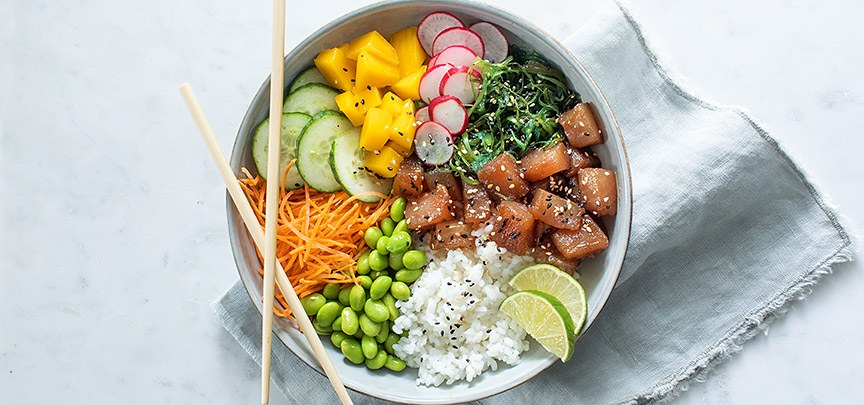

# PokeBowl

## Benodigdheden
250g sushirijst 
120ml Saitaku rijstazijn
300g verse zalmfilets
1/2 rode peper
2 el Kikkoman sojasaus
1 el sesamolie
200g bospenen
1 komkommer
3 bosuien
2 eetrijpe avocado's
2 tl zwart sesamzaad..

### Bereiding
1.  Kook de rijst volgens de aanwijzingen op de verpakking. Roer ⅔ van de rijstazijn door de rijst als deze nog warm is. Laat de rijst in 1 uur afkoelen op een grote platte schaal.

2.  Snijd ondertussen de zalm in blokjes van 1 cm (brunoise). Snijd het steeltje van de halve rode peper en snijd het vruchtvlees fijn. Meng de zalm met de peper, sojasaus en olie. Zet tot gebruik afgedekt in de koelkast.
3.  Schaaf de komkommer en bospeen met een kaasschaaf of dunschiller in lange linten. Besprenkel met de rest van de rijstazijn. Snijd de bosuien in schuine ringetjes. Snijd de avocado’s overlangs doormidden en verwijder de pit. Schep het vruchtvlees uit de schil en snijd in plakjes.
4.  Verdeel de rijst over kommen. Verdeel de zalm, komkommer, wortel, bosui en avocado erover. Bestrooi de zalm met het sesamzaad.

[Bron](https://www.ah.nl/allerhande/recept/R-R1188320/poke-bowl-met-zalm) van recept